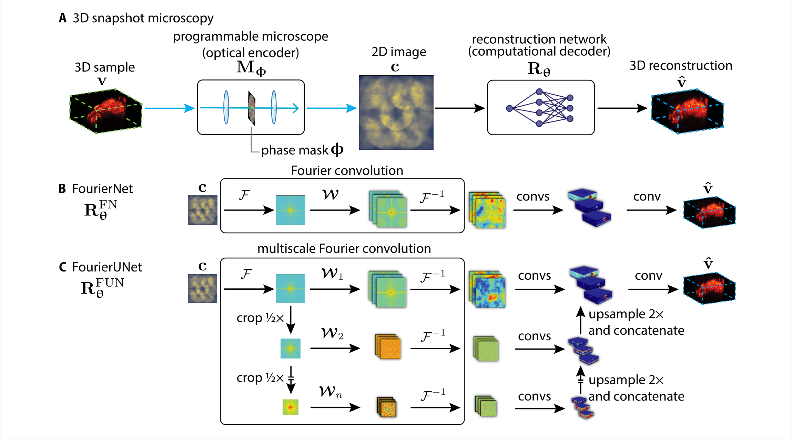
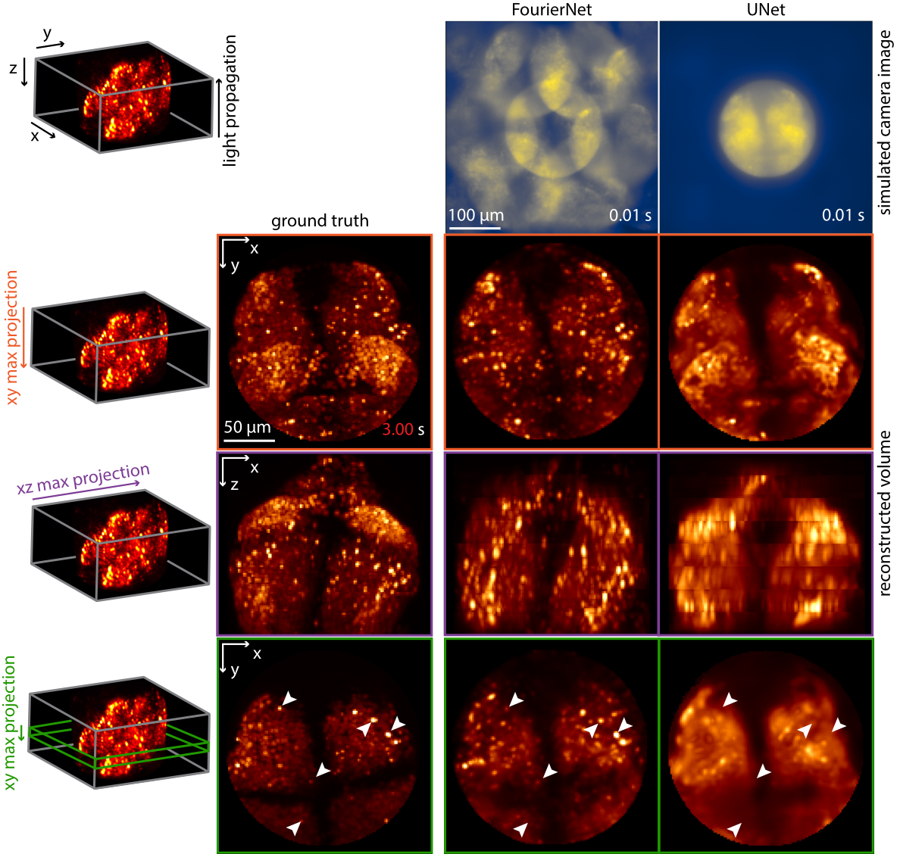
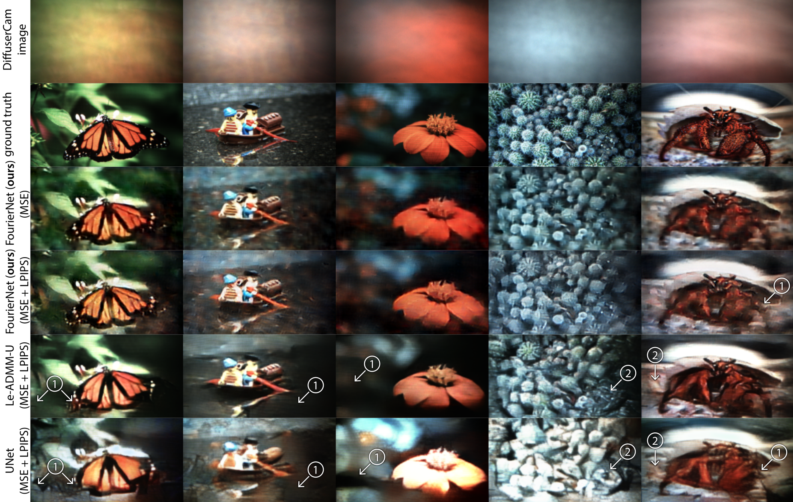

# Differentiable 3D Snapshot Microscope

This repository contains official PyTorch code for implementing a differentiable snapshot microscope and the relevant experiment scripts from the paper: [*Programmable 3D snapshot microscopy with Fourier convolutional networks*](https://arxiv.org/abs/2104.10611).





What is included:

* A differentiable simulation of a 3D snapshot microscope.
* Scripts to recreate experiments from the paper, both using the microscope and using DLMD for computational photography reconstruction.

What is **not** included:
* Implementations of FourierNet/FourierUNet architectures from the paper. This is a dependency for running the experiments, but not for using the simulation. If you want to replicate the experiments using the scripts here, you can obtain the FourierNet implementation from [TuragaLab/fouriernet](https://github.com/TuragaLab/fouriernet).
* This repository does **not** include the data required to run the experiments. The data can be obtained from [Figshare](https://figshare.com) (**coming soon**).

# Installation

We have tested `snapshotscope` on Python 3.7 with PyTorch 1.7. Newer versions of PyTorch will remove the old FFT interface, and cause this software to fail.

To install the library (required for running the experiment scripts), you can run:

```
$ pip install git+https://github.com/TuragaLab/snapshotscope
```

# Usage

```
$ python exp.py <train | test>
```

**You will probably want to change the locations where data is read and results are saved by modifying the provided exp.py files.** These experiment scripts in `experiments` follow the same pattern: they take one argument, which is whether to train or test. If you want to modify any other aspect of the training, you can simply change those settings in the corresponding `exp.py` file.
